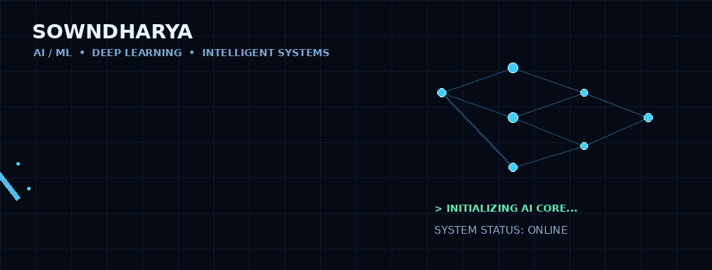

<h1>Sowndharya</h1>

  <b>AI/ML • Deep Learning • Intelligent Systems</b>

  Building intelligent solutions with Machine Learning, Deep Learning,
  Computer Vision and real-world data.

---

## 🧠 About Me

I'm an Information Technology student interested in building practical AI-driven systems that solve real-world problems.

My work focuses on **Machine Learning, Deep Learning, Computer Vision, Intelligent Systems and AI-powered applications**. I enjoy taking an idea from data and model development all the way to a usable application.

Currently, I'm building projects involving **real-time prediction, AI-based decision systems and intelligent applications**.

---

## 🚀 What I Build

- 🤖 Machine Learning applications
- 🧠 Deep Learning models
- 👁️ Computer Vision systems
- 📊 AI-powered prediction platforms
- ⚡ Real-time intelligent systems
- 🌐 AI applications and interactive dashboards

---

## 🔬 Featured Projects

### 🪨 AI-Based Real-Time Rockfall Prediction

**LSTM • TensorFlow • Python • Streamlit**

An AI-based early-warning system designed to predict potential rockfall events in open-pit mines using multi-source sensor data.

### 🎓 EduPredict AI

**Machine Learning • Scikit-Learn • Streamlit**

An AI-powered student performance prediction system that predicts academic outcomes using machine learning.

---

## 🛠️ AI & Technical Interests

**Artificial Intelligence**  
**Machine Learning**  
**Deep Learning**  
**Computer Vision**  
**Intelligent Systems**  
**Data Science**  
**Python**  
**TensorFlow**  
**Scikit-Learn**  
**Streamlit**

---

<b>Building • Learning • Experimenting • Deploying AI</b>

